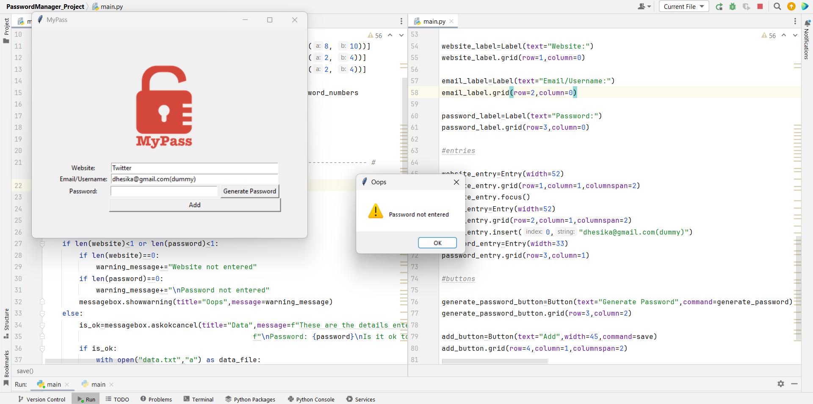
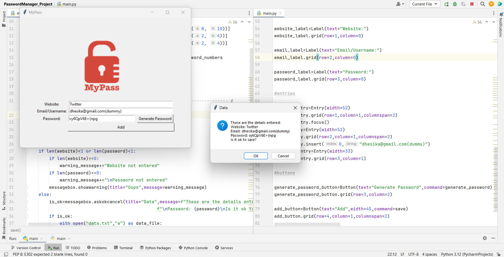

# 100Projects ##

- ## Day 1 ##
<table>
    <tr>
        <td><strong>Topics</strong></td>
        <td>String, String manipulation, Error handling, Input Functions,  String Functions, Variables and naming conventions.</td>
    </tr>
    <tr>
        <td><strong>Project</strong></td>
        <td>BandNameGenerator</td>
    </tr>
    <tr>
        <td><strong>Link</strong></td>
        <td><a href="https://github.com/dhesika-ts/100DaysOfPython/tree/main/Day1">https://github.com/dhesika-ts/100DaysOfPython/tree/main/Day1</a></td>
    </tr>
</table>

  
 
 - ## Day 2 ##
<table>
    <tr>
        <td><strong>Topics</strong></td>
        <td>Data Types, Type casting, Arithmetic operation, Formatting.</td>
    </tr>
    <tr>
        <td><strong>Project</strong></td>
        <td>TipCalculator</td>
    </tr>
    <tr>
        <td><strong>Link</strong></td>
        <td><a href="https://github.com/dhesika-ts/100DaysOfPython/tree/main/Day2">https://github.com/dhesika-ts/100DaysOfPython/tree/main/Day2</a></td>
    </tr>
</table>
  
  
  

- ## Day 3  ##                                                                   
<table>
    <tr>
        <td><strong>Topics</strong></td>
        <td>Conditional Statements, Logical Operations, Code Blocks, Namespacing.</td>
    </tr>
    <tr>
        <td><strong>Project</strong></td>
        <td>TreasureIsland Game</td>
    </tr>
    <tr>
        <td><strong>Link</strong></td>
        <td><a href="https://github.com/dhesika-ts/100DaysOfPython/tree/main/Day3">https://github.com/dhesika-ts/100DaysOfPython/tree/main/Day3</a></td>
    </tr>
</table>
  
  

- ## Day 4  ##                                                                   
<table>
    <tr>
        <td><strong>Topics</strong></td>
        <td>Randomization, List, String to List, Nested List, Index Out of Bound Error.</td>
    </tr>
    <tr>
        <td><strong>Project</strong></td>
        <td>RockPaperScissors Game</td>
    </tr>
    <tr>
        <td><strong>Link</strong></td>
        <td><a href="https://github.com/dhesika-ts/100DaysOfPython/tree/main/Day4">https://github.com/dhesika-ts/100DaysOfPython/tree/main/Day4</a></td>
    </tr>
</table>

  

- ## Day 5   ##                                                                   
<table>
    <tr>
        <td><strong>Topics</strong></td>
        <td>Loops, List Shuffle.</td>
    </tr>
    <tr>
        <td><strong>Project</strong></td>
        <td>PasswordGenerator</td>
    </tr>
    <tr>
        <td><strong>Link</strong></td>
        <td><a href="https://github.com/dhesika-ts/100DaysOfPython/tree/main/Day5">https://github.com/dhesika-ts/100DaysOfPython/tree/main/Day5</a></td>
    </tr>
</table>
  
  

- ## Day 6   ##                                                                   
<table>
    <tr>
        <td><strong>Topics</strong></td>
        <td>Code Block, Indentation, Functions, While Loop.</td>
    </tr>
    <tr>
        <td><strong>Project</strong></td>
        <td>LostInTheMaze Project</td>
    </tr>
    <tr>
        <td><strong>Link</strong></td>
        <td><a href="https://github.com/dhesika-ts/100DaysOfPython/tree/main/Day6">https://github.com/dhesika-ts/100DaysOfPython/tree/main/Day6</a></td>
    </tr>
</table>
  
   

- ## Day 7   ##                                                                   
<table>
    <tr>
        <td><strong>Topics</strong></td>
        <td>Modules, List, String, for and while loops for HangMan Project.</td>
    </tr>
    <tr>
        <td><strong>Project</strong></td>
        <td>Hangman Game</td>
    </tr>
    <tr>
        <td><strong>Link</strong></td>
        <td><a href="https://github.com/dhesika-ts/100DaysOfPython/tree/main/Day7">https://github.com/dhesika-ts/100DaysOfPython/tree/main/Day7</a></td>
    </tr>
</table>
  
  

- ## Day 8   ##                                                                   
<table>
    <tr>
        <td><strong>Topics</strong></td>
        <td>Functions with Input, Rounding numbers, Caeser Cipher</td>
    </tr>
    <tr>
        <td><strong>Project</strong></td>
        <td>CaeserCipher Project</td>
    </tr>
    <tr>
        <td><strong>Link</strong></td>
        <td><a href="https://github.com/dhesika-ts/100DaysOfPython/tree/main/Day8">https://github.com/dhesika-ts/100DaysOfPython/tree/main/Day8</a></td>
    </tr>
</table>

  

- ## Day 9   ##                                                                   
<table>
    <tr>
        <td><strong>Topics</strong></td>
        <td>Dictionaries,Nesting List and Dictionaries </td>
    </tr>
    <tr>
        <td><strong>Project</strong></td>
        <td>SilentAuctionProgram Project</td>
    </tr>
    <tr>
        <td><strong>Link</strong></td>
        <td><a href="https://github.com/dhesika-ts/100DaysOfPython/tree/main/Day9">https://github.com/dhesika-ts/100DaysOfPython/tree/main/Day9</a></td>
    </tr>
    <tr>
        <td><strong>Video Link</strong></td>
        <td><a href="https://youtu.be/9mTfRA6RGic">https://youtu.be/9mTfRA6RGic</a></td>
    </tr>
</table>

- ## Day 10   ##                                                                   
<table>
    <tr>
        <td><strong>Topics</strong></td>
        <td>Functions and Outputs, Recursion, Return statements</td>
    </tr>
    <tr>
        <td><strong>Project</strong></td>
        <td>Calculator Project</td>
    </tr>
    <tr>
        <td><strong>Link</strong></td>
        <td><a href="https://github.com/dhesika-ts/100DaysOfPython/tree/main/Day10">https://github.com/dhesika-ts/100DaysOfPython/tree/main/Day10</a></td>
    </tr>
    <tr>
        <td><strong>Video Link</strong></td>
        <td><a href="https://youtu.be/eiEPmHySoSo">https://youtu.be/eiEPmHySoSo</a></td>
    </tr>
</table>

- ## Day 11   ##                                                                   
<table>
    <tr>
        <td><strong>Topics</strong></td>
        <td>Capstone Project</td>
    </tr>
    <tr>
        <td><strong>Project</strong></td>
        <td>Blackjack Project</td>
    </tr>
    <tr>
        <td><strong>Link</strong></td>
        <td><a href="https://github.com/dhesika-ts/100DaysOfPython/tree/main/Day11">https://github.com/dhesika-ts/100DaysOfPython/tree/main/Day11</a></td>
    </tr>
    <tr>
        <td><strong>Video Link</strong></td>
        <td><a href="https://youtu.be/ySimampXt4g">https://youtu.be/ySimampXt4g</a></td>
    </tr>
</table>

  

- ## Day 12   ##                                                                   
<table>
    <tr>
        <td><strong>Topics</strong></td>
        <td>Local Scope, Global Scope, Namespace</td>
    </tr>
    <tr>
        <td><strong>Project</strong></td>
        <td>NumberGuessingGame Project</td>
    </tr>
   <tr>
        <td><strong>Link</strong></td>
        <td><a href="https://github.com/dhesika-ts/100DaysOfPython/tree/main/Day12">https://github.com/dhesika-ts/100DaysOfPython/tree/main/Day12</a></td>
    </tr>
    <tr>
        <td><strong>Video Link</strong></td>
        <td><a href="https://youtu.be/YpUdO4-GtWs">https://youtu.be/YpUdO4-GtWs</a></td>
    </tr>
</table>

- ## Day 13   ##                                                                   
<table>
    <tr>
        <td><strong>Topics</strong></td>
        <td>Debugging ,Thonny ,Python Tutor</td>
    </tr>
    <tr>
        <td><strong>Project</strong></td>
        <td>Debugging</td>
    </tr>
    <tr>
        <td><strong>Link</strong></td>
        <td><a href="https://github.com/dhesika-ts/100DaysOfPython/tree/main/Day13">https://github.com/dhesika-ts/100DaysOfPython/tree/main/Day13</a></td>
    </tr>
</table>

  

- ## Day 14   ##                                                                   
<table>
    <tr>
        <td><strong>Topics</strong></td>
        <td>Project</td>
    </tr>
    <tr>
        <td><strong>Project</strong></td>
        <td>HigherLowerGame Project</td>
    </tr>
    <tr>
        <td><strong>Link</strong></td>
        <td><a href="https://github.com/dhesika-ts/100DaysOfPython/tree/main/Day14">https://github.com/dhesika-ts/100DaysOfPython/tree/main/Day14</a></td>
    </tr>
    <tr>
        <td><strong>Video Link</strong></td>
        <td><a href="https://youtu.be/8XxxHjhTxjw">https://youtu.be/8XxxHjhTxjw</a></td>
    </tr>
</table>

  

- ## Day 15   ##                                                                   
<table>
    <tr>
        <td><strong>Topics</strong></td>
        <td>PyCharm Installation and walkthrough, Project</td>
    </tr>
    <tr>
        <td><strong>Project</strong></td>
        <td>CoffeeMachine Project</td>
    </tr>
    <tr>
        <td><strong>Link</strong></td>
        <td><a href="https://github.com/dhesika-ts/100DaysOfPython/tree/main/Day15">https://github.com/dhesika-ts/100DaysOfPython/tree/main/Day15</a></td>
    </tr>
    <tr>
        <td><strong>Video Link</strong></td>
        <td><a href="https://youtu.be/d0yUlTJoblU">https://youtu.be/d0yUlTJoblU</a></td>
    </tr>
</table>

  

- ## Day 16   ##                                                                   
<table>
    <tr>
        <td><strong>Topics</strong></td>
        <td>OOPS</td>
    </tr>
    <tr>
        <td><strong>Project</strong></td>
        <td>CoffeeMakerWithClassesAndObjects Project</td>
    </tr>
    <tr>
        <td><strong>Link</strong></td>
        <td><a href="https://github.com/dhesika-ts/100DaysOfPython/tree/main/Day16">https://github.com/dhesika-ts/100DaysOfPython/tree/main/Day16</a></td>
    </tr>
</table>

- ## Day 17   ##                                                                   
<table>
    <tr>
        <td><strong>Topics</strong></td>
        <td>Benefits of OOPS, constructor, pass keyword</td>
    </tr>
    <tr>
        <td><strong>Project</strong></td>
        <td>Quiz Project with OOPS</td>
    </tr>
    <tr>
        <td><strong>Link</strong></td>
        <td><a href="https://github.com/dhesika-ts/100DaysOfPython/tree/main/Day17">https://github.com/dhesika-ts/100DaysOfPython/tree/main/Day17</a></td>
    </tr>
    <tr>
        <td><strong>Video Link</strong></td>
        <td><a href="https://youtu.be/0r-uvCCJgqg">https://youtu.be/0r-uvCCJgqg</a></td>
    </tr>
</table>

  

- ## Day 18   ##                                                                   
<table>
    <tr>
        <td><strong>Topics</strong></td>
        <td>Turtle Graphics, Colorgram, RGB tool, Pypi, Tkcolor</td>
    </tr>
    <tr>
        <td><strong>Project</strong></td>
        <td>HirstPainting Project</td>
    </tr>
    <tr>
        <td><strong>Link</strong></td>
        <td><a href="https://github.com/dhesika-ts/100DaysOfPython/tree/main/Day18">https://github.com/dhesika-ts/100DaysOfPython/tree/main/Day18</a></td>
    </tr>
        <tr>
        <td><strong>Video Link</strong></td>
        <td><a href="https://youtu.be/SKRHRx8sVEw">https://youtu.be/SKRHRx8sVEw</a></td>
    </tr>
</table>

  

- ## Day 19   ##                                                                   

<table>
    <tr>
        <td><strong>Topics</strong></td>
        <td>Advanced Turtle Graphics, EventListeners, Higher-order state, multiple instances</td>
    </tr>
    <tr>
        <td><strong>Project</strong></td>
        <td>TurtleRace Project</td>
    </tr>
    <tr>
        <td><strong>Link</strong></td>
        <td><a href="https://github.com/dhesika-ts/100DaysOfPython/tree/main/Day19">https://github.com/dhesika-ts/100DaysOfPython/tree/main/Day19</a></td>
    </tr>
    <tr>
        <td><strong>Video Link</strong></td>
        <td><a href="https://youtu.be/bT-K3SVSERE">https://youtu.be/bT-K3SVSERE</a></td>
    </tr>
</table>

  

- ## Day 20   ##                                                                   
<table>
    <tr>
        <td><strong>Topics</strong></td>
        <td>Turtle Graphics methods (setup, bgcolor, title, tracer, update, time.sleep)</td>
    </tr>
    <tr>
        <td><strong>Modules Completed</strong></td>
        <td>Create Snake body, Move the Snake, Control the Snake</td>
    </tr>
    <tr>
        <td><strong>Project</strong></td>
        <td>SnakeGame Part1</td>
    </tr>
    <tr>
        <td><strong>Link</strong></td>
        <td><a href="https://github.com/dhesika-ts/100DaysOfPython/tree/main/Day20">https://github.com/dhesika-ts/100DaysOfPython/tree/main/Day20</a></td>
    </tr>
    <tr>
        <td><strong>Video Link</strong></td>
        <td><a href="https://youtu.be/UedY_eHs_Eg">https://youtu.be/UedY_eHs_Eg</a></td>
    </tr>
</table>

  

- ## Day 21   ##                                                                   
<table>
    <tr>
        <td><strong>Topics</strong></td>
        <td>Class Inheritance, Slicing, More Turtle methods </td>
    </tr>
    <tr>
        <td><strong>Project</strong></td>
        <td>SnakeGame Part2</td>
    </tr>
    <tr>
        <td><strong>Modules completed</strong></td>
        <td>Detect collision with food, Create Scoreboard, Detect collision with wall, Detect Collision with Tail</td>
    </tr>
    <tr>
        <td><strong>Link</strong></td>
        <td><a href="https://github.com/dhesika-ts/100DaysOfPython/tree/main/Day21">https://github.com/dhesika-ts/100DaysOfPython/tree/main/Day21</a></td>
    </tr>
    <tr>
        <td><strong>Video Link</strong></td>
        <td><a href="https://youtu.be/TufT3y-uyrY">https://youtu.be/TufT3y-uyrY</a></td>
    </tr>
    
</table>

  

- ## Day 22   ##                                                                   
<table>
    <tr>
        <td><strong>Topics</strong></td>
        <td>Advanced Turtle Graphics, OOPS</td>
    </tr>
    <tr>
        <td><strong>Project</strong></td>
        <td>Pong Game</td>
    </tr>
    <tr>
        <td><strong>Modules</strong></td>
        <td>Creating Screen, Creating and moving Paddles, Creating and moving Ball, Detecting Collision with wall and Bounce,  Detecting collision with Paddle, Detecting misses, Keeping Score</td>
    </tr>
    <tr>
        <td><strong>Link</strong></td>
        <td><a href="https://github.com/dhesika-ts/100DaysOfPython/tree/main/Day22">https://github.com/dhesika-ts/100DaysOfPython/tree/main/Day22</a></td>
    </tr>
    <tr>
        <td><strong>Video Link</strong></td>
        <td><a href="https://youtu.be/DY2EtEtsfgQ">https://youtu.be/DY2EtEtsfgQ</a></td>
    </tr>
    
</table>

  

- ## Day 23   ##                                                                   
<table>
    <tr>
        <td><strong>Topics</strong></td>
        <td>Turtle Graphics, Random Chances</td>
    </tr>
    <tr>
        <td><strong>Project</strong></td>
        <td>TurtleCrossing Capstone Game Project</td>
    </tr>
    <tr>
        <td><strong>Modules</strong></td>
        <td>Move Turtle with Key, Create and move cars, Detect collisions with cars,  Detect when Turtle reaches another side, Create scoreboard</td>
    </tr>
    <tr>
        <td><strong>Link</strong></td>
        <td><a href="https://github.com/dhesika-ts/100DaysOfPython/tree/main/Day23">https://github.com/dhesika-ts/100DaysOfPython/tree/main/Day23</a></td>
    </tr>
    <tr>
        <td><strong>Video Link</strong></td>
        <td><a href="https://youtu.be/bCJrOqn2Kl8">https://youtu.be/bCJrOqn2Kl8</a></td>
    </tr>
    
</table>

  

- ## Day 24   ##                                                                   
<table>
    <tr>
        <td><strong>Topics</strong></td>
        <td>Files, Directories and Paths</td>
    </tr>
    <tr>
        <td><strong>Project</strong></td>
        <td>SnakeGame Updated with HighScore, MailMerge</td>
    </tr>
    <tr>
        <td><strong>Link</strong></td>
        <td><a href="https://github.com/dhesika-ts/100DaysOfPython/tree/main/Day24">https://github.com/dhesika-ts/100DaysOfPython/tree/main/Day24</a></td>
    </tr>
    <tr>
        <td><strong>Video Link</strong></td>
        <td><a href="https://youtu.be/fgc-hzSCkWc">https://youtu.be/fgc-hzSCkWc</a></td>
    </tr>
    
</table>

  

- ## Day 25   ##                                                                   
<table>
    <tr>
        <td><strong>Topics</strong></td>
        <td>Pandas and its methods, DataFrame, Series, Turtle image coordinates</td>
    </tr>
    <tr>
        <td><strong>Project</strong></td>
        <td>States Guessing Project</td>
    </tr>
    <tr>
        <td><strong>Link</strong></td>
        <td><a href="https://github.com/dhesika-ts/100DaysOfPython/tree/main/Day25">https://github.com/dhesika-ts/100DaysOfPython/tree/main/Day25</a></td>
    </tr>
    <tr>
        <td><strong>Video Link</strong></td>
        <td><a href="https://youtu.be/u2DzJI_PEnk">https://youtu.be/u2DzJI_PEnk</a></td>
    </tr>
    
</table>

  

- ## Day 26   ##                                                                   
<table>
    <tr>
        <td><strong>Topics</strong></td>
        <td>List Comprehension, Dictionary Comprehension, Looping through rows in Pandas DataFrame</td>
    </tr>
    <tr>
        <td><strong>Project</strong></td>
        <td>PhoneticDictionary Project</td>
    </tr>
    <tr>
        <td><strong>Link</strong></td>
        <td><a href="https://github.com/dhesika-ts/100DaysOfPython/tree/main/Day26">https://github.com/dhesika-ts/100DaysOfPython/tree/main/Day26</a></td>
    </tr>
    
</table>

- ## Day 27   ##                                                                   
<table>
    <tr>
        <td><strong>Topics</strong></td>
        <td>Tkinter, Function args(*args,**kwargs), Label, Button, Entry, TextEntryBox, Spinbox, Scale, Checkbox, RadioButton, Listbox</td>
    </tr>
    <tr>
        <td><strong>Project</strong></td>
        <td>UnitConvereter Project</td>
    </tr>
    <tr>
        <td><strong>Link</strong></td>
        <td><a href="https://github.com/dhesika-ts/100DaysOfPython/tree/main/Day27">https://github.com/dhesika-ts/100DaysOfPython/tree/main/Day27</a></td>
    </tr>
    
</table>

- ## Day 28   ##                                                                   
<table>
    <tr>
        <td><strong>Topics</strong></td>
        <td>Tkinter, Canvas, Timer</td>
    </tr>
    <tr>
        <td><strong>Project</strong></td>
        <td>Pomodoro Project (Productivity Timer App for regular work & break)</td>
    </tr>
    <tr>
        <td><strong>Link</strong></td>
        <td><a href="https://github.com/dhesika-ts/100DaysOfPython/tree/main/Day28">https://github.com/dhesika-ts/100DaysOfPython/tree/main/Day28</a></td>
    </tr>
    <tr>
        <td><strong>Video Link</strong></td>
        <td><a href="https://youtu.be/Z5_vGZu2kHQ">https://youtu.be/Z5_vGZu2kHQ</a></td>
    </tr>
    
</table>

  

- ## Day 29   ##                                                                   
<table>
    <tr>
        <td><strong>Topics</strong></td>
        <td>Tkinter, column-span, insert, delete entry, message popup, pyperclip</td>
    </tr>
    <tr>
        <td><strong>Project</strong></td>
        <td>PasswordManager Project</td>
    </tr>
    <tr>
        <td><strong>Link</strong></td>
        <td><a href="https://github.com/dhesika-ts/100DaysOfPython/tree/main/Day29">https://github.com/dhesika-ts/100DaysOfPython/tree/main/Day29</a></td>
    </tr>
    <tr>
        <td><strong>Video Link</strong></td>
        <td><a href="https://youtu.be/r5e31j_ptOI">https://youtu.be/r5e31j_ptOI</a></td>
    </tr>
    
</table>

  

- ## Day 30   ##                                                                   
<table>
    <tr>
        <td><strong>Topics</strong></td>
        <td>Errors and Exceptions, Exception Handling, JSON(read, write and update)</td>
    </tr>
    <tr>
        <td><strong>Project</strong></td>
        <td>PasswordManager Updated (With Search Password option and data in JSON file)</td>
    </tr>
    <tr>
        <td><strong>Link</strong></td>
        <td><a href="https://github.com/dhesika-ts/100DaysOfPython/tree/main/Day30">https://github.com/dhesika-ts/100DaysOfPython/tree/main/Day30</a></td>
    </tr>
    <tr>
        <td><strong>Video Link</strong></td>
        <td><a href="https://youtu.be/LxVostOktjk">https://youtu.be/LxVostOktjk</a></td>
    </tr>
    
</table>

  

- ## Day 31   ##                                                                   
<table>
    <tr>
        <td><strong>Topics</strong></td>
        <td>Tkinter, to_csv, index, timer, Buttons with image</td>
    </tr>
    <tr>
        <td><strong>Project</strong></td>
        <td>FlashCard Project</td>
    </tr>
    <tr>
        <td><strong>Link</strong></td>
        <td><a href="https://github.com/dhesika-ts/100DaysOfPython/tree/main/Day31">https://github.com/dhesika-ts/100DaysOfPython/tree/main/Day31</a></td>
    </tr>
    <tr>
        <td><strong>Video Link</strong></td>
        <td><a href="https://youtu.be/4VluVhOLuf0">https://youtu.be/4VluVhOLuf0</a></td>
    </tr>
    
</table>

  

- ## Day 32   ##                                                                   
<table>
    <tr>
        <td><strong>Topics</strong></td>
        <td>Send emails with smtplib, Datetime module, PythonAnywhere(to run python code in cloud) </td>
    </tr>
    <tr>
        <td><strong>Project</strong></td>
        <td>BirthdayWisher Project </td>
    </tr>
    <tr>
        <td><strong>Link</strong></td>
        <td><a href="https://github.com/dhesika-ts/100DaysOfPython/tree/main/Day32">https://github.com/dhesika-ts/100DaysOfPython/tree/main/Day32</a></td>
    </tr>
    <tr>
        <td><strong>Video Link</strong></td>
        <td><a href="https://youtu.be/HbbzzYnguEA">https://youtu.be/HbbzzYnguEA</a></td>
    </tr>
    
</table>

  

IssOverheadNotifier_Project
- ## Day 33   ##                                                                   
<table>
    <tr>
        <td><strong>Topics</strong></td>
        <td>API (calls, params, Endpoints), HTTP status codes, ISS API, JSON viewer </td>
    </tr>
    <tr>
        <td><strong>Project</strong></td>
        <td>Iss Overhead Notifier Project</td>
    </tr>
    <tr>
        <td><strong>Link</strong></td>
        <td><a href="https://github.com/dhesika-ts/100DaysOfPython/tree/main/Day33">https://github.com/dhesika-ts/100DaysOfPython/tree/main/Day33</a></td>
    </tr>
    
</table>

- ## Day 34   ##                                                                   
<table>
    <tr>
        <td><strong>Topics</strong></td>
        <td></td>
    </tr>
    <tr>
        <td><strong>Project</strong></td>
        <td></td>
    </tr>
    <tr>
        <td><strong>Link</strong></td>
        <td></td>
    </tr>
    <tr>
        <td><strong>Video Link</strong></td>
        <td></td>
    </tr>
    
</table>

  
